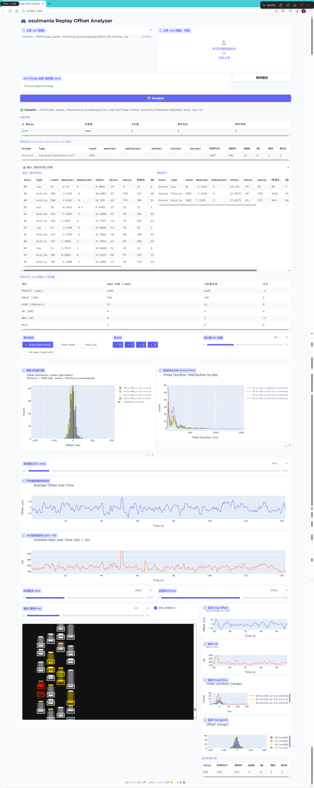

# osu!mania Replay Offset Analyzer

An osu!mania replay analysis tool that parses `.osr` replays, matches player keypress actions to beatmap notes using an action-driven algorithm, computes timing offsets and judgment distributions, and provides both a CLI analysis engine and an interactive Gradio WebUI.

## Requirements

- Python 3.10+
- [gradio](https://pypi.org/project/gradio/) — WebUI framework
- [plotly](https://pypi.org/project/plotly/) — interactive charts
- [numpy](https://pypi.org/project/numpy/) (>=1.20, <2.0) — histogram binning
- [matplotlib](https://pypi.org/project/matplotlib/) — CLI histogram plots (optional, only for `plot_offsets.py`)

```bash
pip install gradio plotly "numpy<2" matplotlib
```

## Usage

### WebUI (recommended)

```bash
python webui.py
```

Opens at `http://127.0.0.1:7860`. Upload a `.osr` replay file (required) and optionally a `.osu` beatmap. Configure the osu! Songs directory in settings for automatic beatmap lookup.

#### Example

## Project Structure

```
ReplayAnalyzer/
├── webui.py                Gradio WebUI (main entry point)
├── analyze_offsets.py      CLI analysis engine (action-driven judge, stats)
├── osr_parser.py           .osr replay binary parser (LZMA, mods, game modes)
├── osu.py                  .osu beatmap file parser
├── mania.py                Mania beatmap helper (column mapping)
├── plot_offsets.py         CLI histogram plotter (matplotlib)
├── example.py              Minimal replay JSON dumper
├── settings.json           Persisted settings (songs path)
├── cases/                  Test replay and beatmap files
├── data/                   Analysis output (JSON, PNG)
└── docs/mania_replay_mapping.md   Replay frame bitmask format reference
```


